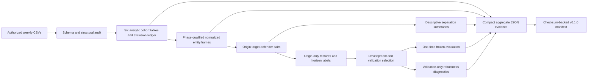

# Architecture

## 1. System objective

Gridiron Spatial Intelligence studies how origin geometry for a
competition-designated target and observed defensive entities relates to
future target–defender separation dynamics. It is a research pipeline, not a
deployed service or API.

## 2. Dataset constraints

The audited 2023 competition release contains 272 games and 14,108 tracked
plays. It supplies a designated target and partial player trajectories rather
than complete 22-player tracking, every receiving option, or direct ball-path
information. Future separation is therefore evaluated only for defenders with
valid supplied output trajectories.

## 3. High-level data flow



## 4. Module and script responsibilities

| Responsibility | Reusable modules | Entry points |
|---|---|---|
| Source validation | `data_audit.py`, `milestone_1_validation.py` | `run_data_audit.py`, `run_milestone_1_validation.py` |
| Cohorts and exclusions | `cohort.py`, `cohort_artifacts.py` | `build_cohort_artifacts.py`, cohort smoke scripts |
| Coordinate normalization | `coordinates.py`, `coordinate_frame.py`, `normalized_tracking.py`, `normalized_artifacts.py` | `build_normalized_tracking.py`, `smoke_week_normalization.py` |
| Pair geometry | `receiver_defender_pairs.py` | `smoke_week_receiver_defender_pairs.py` |
| Descriptive summaries | `separation_summary.py` | `analyze_full_season_separation.py` |
| Features and baselines | `baseline_features.py`, `baseline_models.py` | `select_baseline_models.py` |
| Frozen evaluation | `frozen_evaluation.py` | `evaluate_frozen_baselines.py`—historical one-time protocol only |
| Robustness | `model_interpretation.py`, `calibration_analysis.py`, `error_analysis.py` | Three corresponding `analyze_*.py` scripts |
| Release provenance | — | `build_release_evidence_manifest.py` |

## 5. Frozen schemas and keys

The cohort layer freezes six tables: `source_plays`,
`descriptive_target_frames`, `primary_origins`,
`trajectory_eligibility`, `future_separation_eligibility`, and
`pair_exclusions`. A separate exclusion ledger reconciles every excluded unit
to one deterministic primary reason.

Binding units include:

- play: `(game_id, play_id)`;
- entity-frame: `(game_id, play_id, phase, frame_id, nfl_id)`;
- target-frame: the entity-frame context plus `target_nfl_id`;
- target–defender pair-frame: target-frame plus `defender_nfl_id`;
- prediction origin: play, target, origin kind, and immutable origin frame;
- entity- or target-origin-horizon: origin plus H5, H10, or H15.

Ordered schemas, keys, dtypes, uniqueness, and reconciliation are enforced in
synthetic tests and artifact manifests.

## 6. Phase-qualified input/output handling

Input and output frame IDs are separate sequences that both begin at 1.
`phase` is therefore mandatory in every entity-frame key. The immutable origin
is the maximum valid raw input frame for a play. Input relative frames end at
0; output relative frames begin at 1. Output coordinates may form labels but
never prediction features.

## 7. Coordinate-normalization contract

Rightward plays retain raw `x` and `y`. Leftward plays receive a 180-degree
rotation:

```text
x_norm = 120.0 - x
y_norm = 53.3 - y
angle_norm = (angle + 180) mod 360
```

Raw `x`, `y`, `dir`, and `o` remain immutable. The transformation is
reversible, preserves pairwise distance, does not clip coordinates, and
records boundary flags and a transform version.

## 8. Weekly partitioning strategy

Artifacts are built in chronological week partitions. Games and every related
play, frame, entity, pair, and horizon remain within one split:

- Weeks 01–12: `development_train`;
- Weeks 13–15: `validation`;
- Weeks 16–18: `frozen_test`.

Random row-level splitting is prohibited.

## 9. Pair-construction logic

Descriptive geometry includes every valid observed defensive entity at the
same input frame as the target. Future-evaluable pairs additionally require
the target and defender to have valid supplied output through the requested
horizon. Defender ordering uses origin separation with player ID only as a
deterministic tie-breaker. “Nearest” describes geometry, not coverage.

## 10. Feature and model pipeline

Each H5, H10, and H15 task uses origin-only separation, relative displacement,
absolute displacement, normalized target/defender location, defender count,
defender rank, and a nearest-defender indicator. Identifiers remain outside
the feature matrix.

Development-fitted median imputation and standardization are coupled with
registered constant, single-feature, ordinary linear/logistic, ridge, and
L2-logistic candidates. Validation selects the frozen specification. The
test split is evaluated once.

## 11. Aggregate evidence flow

Large cohort and normalized tables remain ignored Parquet. Nine allowlisted
aggregate JSON files preserve cohort/normalization provenance, descriptive
results, frozen selection/evaluation, and robustness diagnostics. The
`v0.1.0` evidence manifest records their ordered paths, roles, byte sizes,
SHA-256 checksums, format/status metadata, cross-artifact checks, and frozen
evaluation policy.

## 12. Leakage boundaries

- Feature frames may not exceed the immutable origin.
- Output coordinates, future separation, future availability, outcomes,
  IDs, split, and week are prohibited features.
- Preprocessing fits on development only.
- Validation selects registered candidates but does not fit transforms.
- Weeks 16–18 cannot trigger revisions.
- Milestone 5 diagnostics use Weeks 01–15 and do not reopen the frozen test.

## 13. Artifact boundaries

Git includes code, tests, documentation, and compact aggregate evidence. It
excludes raw NFL data, derived Parquet, pair-level rows, predictions, fitted
models, and caches. Artifact writers use staging, schema/key validation,
checksums, and atomic replacement.

## 14. Architecture tradeoffs

- Partial entity coverage enables a bounded target-centric analysis but not
  full-field control or passing-window claims.
- Phase-qualified keys add verbosity but prevent input/output frame collision.
- Separate horizon cohorts avoid fabricating missing labels but make H15 more
  selective.
- Simple registered baselines improve auditability at the expense of model
  capacity.
- Chronological splits preserve temporal realism but cannot measure
  cross-season generalization.
- Aggregate evidence is reviewable without restricted data, while full
  analytical reproduction still requires authorized source files.
